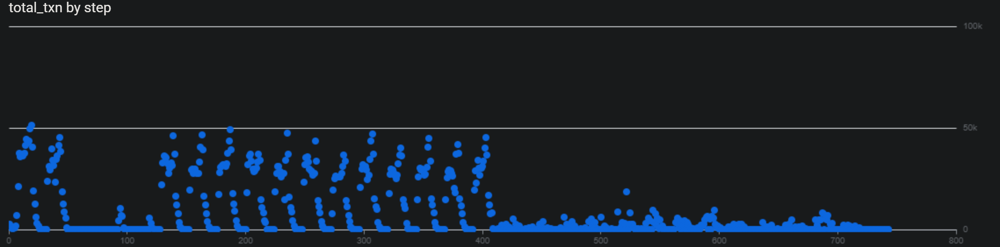

# Preliminary SQL Analysis – PaySim Fraud Dataset

**Dataset Columns:**  
`step`, `type`, `amount`, `nameOrig`, `oldBalanceOrig`, `newBalanceOrig`, `nameDest`, `oldBalanceDest`, `newBalanceDest`, `isFraud`, `isFlaggedFraud`  

---

## 1. Dataset Overview

### 1.1 Total Transactions
```sql
SELECT COUNT(*) AS total_transactions
FROM transactions;
```

Insights: The dataset contains 6362620 total transactions.

### 1.2 Total Fraudulent Transactions
```sql
SELECT COUNT(*) AS total_fraud
FROM transactions
WHERE isFraud = 1;
```

Insights: There are 8213 fraudulent transactions.

### 1.3 Transactions per Type
```sql
SELECT type, COUNT(*) AS total
FROM transactions
GROUP BY type
ORDER BY total DESC;
```

Insights: The most common transaction is "CASH_OUT" (2237500 records) followed by "PAYMENT" (2151495), "CASH_IN" (1399284), "TRANSFER" (532909) and "DEBIT" (41432).

### 1.4 Fraudulent Transactions per Type
```sql
SELECT type, COUNT(*) AS total_fraud
FROM transactions
WHERE isFraud = 1
GROUP BY type
ORDER BY total_fraud DESC;
```

Insights: The number of fraudulent CASH_OUT (4,116) and TRANSFER (4,097) transactions is very similar. This likely reflects the typical fraud pattern in the dataset, where funds are first transferred to a fraudulent account (TRANSFER) and then quickly cashed out (CASH_OUT), resulting in nearly equal counts for both steps of the scheme.

## 2. Descriptive Statistics
### 2.1 Amount Statistics (All Transactions)
```sql
SELECT 
    MIN(amount) AS min_amount,
    MAX(amount) AS max_amount,
    AVG(amount) AS avg_amount,
    SUM(amount) AS total_amount
FROM transactions;
```

Insights: The transaction amounts range from a minimum of 0.0 to a maximum of 92,445,516.64 with an average of 179,861.90 per transaction. The total value of all transactions is 1,144,392,944,759.76.

### 2.2 Amount Statistics (Fraudulent Transactions)
```sql
SELECT 
    MIN(amount) AS min_amount,
    MAX(amount) AS max_amount,
    AVG(amount) AS avg_amount,
    SUM(amount) AS total_amount
FROM transactions
WHERE isFraud = 1;

SELECT
    SUM(amount) AS total_amount,
    SUM(CASE WHEN isFraud = 1 THEN amount ELSE 0 END) AS total_fraud_amount,
    ROUND(100.0 * SUM(CASE WHEN isFraud = 1 THEN amount ELSE 0 END) / SUM(amount), 4) AS fraud_amount_percentage
FROM transactions;
```

Insights: Fraudulent transactions have amounts ranging from 0.0 to 10,000,000.0, with an average value of 1,467,967.29 per transaction. The total value of all fraudulent transactions is 12,056,415,427.84, representing approximately 1.05% of the total transaction volume.

### 2.3 Fraud Rate by Transaction Type
```sql
SELECT 
    type,
    COUNT(*) AS total,
    SUM(isFraud) AS fraud_count,
    ROUND(AVG(isFraud)*100,2) AS fraud_percentage
FROM transactions
GROUP BY type
ORDER BY fraud_percentage DESC;
```

Insights: The TRANSFER category exhibits the highest fraud rate at 0.77%, followed by CASH_OUT at 0.18%, while all other transaction types show a 0% fraud rate.

## 3. Balance Checks / Data Quality
### 3.1 Transactions with Zero Origin Balance but Non-Zero Amount
```sql
SELECT COUNT(*) AS zero_orig_balance
FROM transactions
WHERE oldBalanceOrg = 0 
  AND amount > 0
  AND type NOT IN ('CASH_IN');
```

Insights: There are over 2 million transactions (mainly CASH_OUT and TRANSFER) where the origin account shows a zero balance both before and after the transaction, while the destination still receives funds. This inconsistency is due to how the PaySim simulator generates synthetic data — it does not always enforce strict accounting logic. These records may not represent real-world transactions but are useful for training fraud detection models where anomalies are expected.

### 3.2 Transactions with Zero Destination Balance but Non-Zero Amount
```sql
SELECT COUNT(*) AS zero_dest_balance
FROM transactions
WHERE oldBalanceDest = 0 AND amount > 0;
```

Insights: Over 2.7 million transactions involve money being sent to destination accounts with an initial balance of zero. While this is normal for new or dormant accounts, it is also a common behavior in fraudulent transfers to mule accounts. These transactions should be retained and profiled further, as they may provide valuable fraud-detection signals.

### 3.3 Fraudulent Transactions with Zero Destination Balance
```sql
SELECT COUNT(*) AS fraud_zero_dest
FROM transactions
WHERE isFraud = 1 AND oldBalanceDest = 0 AND newBalanceDest = 0;

SELECT COUNT(*) AS fraud_zero_dest,
type
FROM transactions
WHERE isFraud = 1 AND oldBalanceDest = 0 AND newBalanceDest = 0
GROUP BY type;
```

Insights: Out of 4,076 fraudulent transactions, nearly all (4,068, or ~99.8%) were TRANSFERs into destination accounts with a zero starting balance, while only 8 transactions (~0.2%) were CASH_OUTs under the same condition. This pattern strongly suggests that fraudsters frequently use new or dormant mule accounts as the initial destination for illicit funds before moving or withdrawing them. As a result, transactions where the destination balance is zero, especially in the TRANSFER category, represent a high-risk fraud indicator and could be a key feature for fraud detection models.

## 4. Account-Level Analysis
### 4.1 Total Transactions per Origin Account
```sql
SELECT nameOrig, COUNT(*) AS total_txn, SUM(amount) AS total_amount
FROM transactions
GROUP BY nameOrig
ORDER BY total_txn DESC
LIMIT 10;
```

Insights: The accounts with the highest number of transactions each only executed a few operations, but often with substantial total amounts. This suggests that transaction frequency alone is not a strong indicator of risk, while the monetary value of transactions may be more relevant for detecting anomalies or fraud. Accounts with relatively few but high-value transactions could be more suspicious than those with many smaller ones.

### 4.2 Total Fraudulent Transactions per Origin Account
```sql
SELECT nameOrig, COUNT(*) AS total_fraud, SUM(amount) AS total_fraud_amount
FROM transactions
WHERE isFraud = 1
GROUP BY nameOrig
ORDER BY total_fraud DESC
LIMIT 10;

SELECT
  COUNT(*) AS fraud_txn_count,
  AVG(amount) AS avg_amount_fraud_incl_zero,
  APPROX_QUANTILES(amount, 1001)[OFFSET(500)] AS median_amount_fraud_incl_zero,

  -- Excluding zero amounts (useful given many fraud rows have amount = 0)
  AVG(IF(amount > 0, amount, NULL)) AS avg_amount_fraud_excl_zero,
  APPROX_QUANTILES(IF(amount > 0, amount, NULL), 1001)[OFFSET(500)] AS median_amount_fraud_excl_zero,

  -- Context on zeros
  SUM(CASE WHEN amount = 0 THEN 1 ELSE 0 END) AS zero_amount_fraud_count,
  ROUND(100.0 * SUM(CASE WHEN amount = 0 THEN 1 ELSE 0 END) / COUNT(*), 4) AS zero_amount_fraud_pct
FROM transactions
WHERE isFraud = 1;
```

Insights: Each fraudulent account in the dataset initiates only one fraudulent transaction, and the transaction amounts vary significantly—from 0 to very high values. The average amount is ~$1.47M and the median is ~$441K, with only 16 transactions having an amount of zero. This suggests that fraud typically occurs as a single, high-value attempt rather than repeated small transactions. 
Additionally, origin accounts with only a single transaction may be particularly relevant for detecting anomalies or fraud, as these accounts could represent one-off attempts to bypass normal transaction patterns.

### 4.3 Accounts Involved in Both TRANSFER and CASH_OUT Fraud
```sql
SELECT DISTINCT t1.nameDest AS fraud_account
FROM transactions t1
JOIN transactions t2
  ON t1.nameDest = t2.nameOrig
WHERE t1.type = 'TRANSFER' AND t1.isFraud = 1
  AND t2.type = 'CASH_OUT' AND t2.isFraud = 1;
```

Insights: No destination accounts appear as both the recipient of a fraudulent TRANSFER and the origin of a fraudulent CASH_OUT. This suggests that fraudulent funds are not being immediately routed through another account in the dataset, implying that fraudsters may be cashing out directly or using separate accounts for different fraudulent activities.

## 5. Time-Based Analysis
### 5.1 Fraudulent Transactions Over Time
```sql
SELECT step, COUNT(*) AS fraud_count
FROM transactions
WHERE isFraud = 1
GROUP BY step
ORDER BY step;
```

Insights: The distribution of fraudulent transactions over time appears fairly scattered, without a single dominant time step. Most steps have a small number of frauds, typically under 20 per step, with occasional spikes reaching higher counts. This suggests that fraud attempts are sporadic rather than concentrated in a particular period, indicating that fraudsters are not restricted to specific times and may attempt attacks throughout the dataset's timeline.


### 5.2 Total Transactions Over Time
```sql
SELECT step, COUNT(*) AS total_txn
FROM transactions
GROUP BY step
ORDER BY step;
```

Insights: The overall transaction volume shows a noticeable daily rhythm, with activity peaking during typical working hours and tapering off into the night. This distribution aligns with expected user behavior, where financial activity is more common during business hours and significantly reduced overnight.

